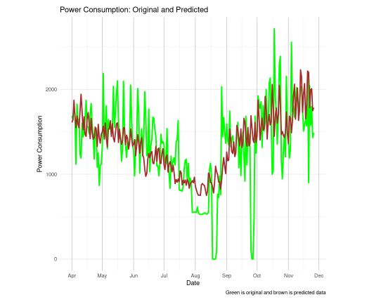

# ⚡ Household Power Consumption Prediction

  

  <b>Machine Learning–based forecasting of daily household electricity consumption</b>

---

## 📌 Overview

This project focuses on predicting **daily household power consumption (kW)** using historical electricity usage data spanning nearly **four years**.  
Accurate forecasting enables energy providers to optimize generation planning while helping consumers manage and reduce energy usage.

Multiple regression models are trained and evaluated to identify the most effective approach.

---

## 📊 Dataset

The dataset originates from the **UCI Machine Learning Repository** and is split into:

- `df_train.csv` — training data  
- `df_test.csv` — testing data  

### Target Variable
- `power_consumption` (kilowatts)

### Key Features
- Date-based and calendar variables (year, semester, quarter, month)
- Weekly and seasonal indicators
- Engineered weekday features

Detailed preprocessing steps and licensing information are available in `License.ipynb`.

---

## 🧠 Methodology

- Datetime parsing and temporal feature engineering  
- One-hot encoding for categorical weekday data  
- Model training and comparison using **RMSE**

### Models Implemented
- **Linear Regression** (baseline)
- **Random Forest Regressor**
- **XGBoost Regressor**

The model with the lowest RMSE was selected for final prediction and visualization.

---

## 📈 Results

  

- Random Forest achieved the best predictive performance  
- Predictions closely follow real consumption trends  
- Seasonal and weekly patterns are effectively captured  
